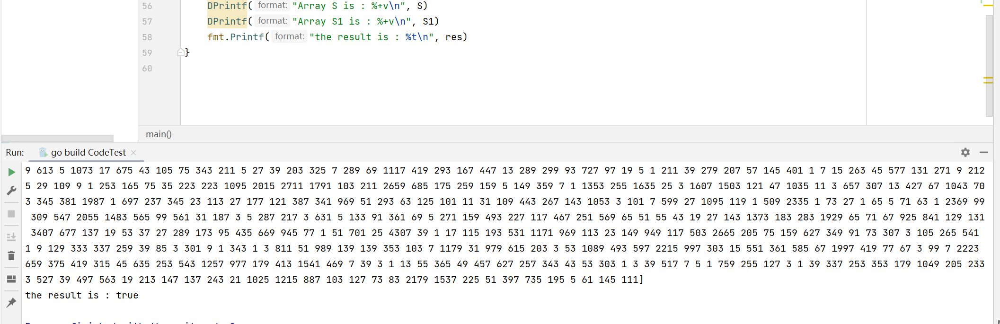

**题目：**

给定一个长度为N（N=100,000)的整数数组S，有M（M>=2)个workers并发访问S并更新S。每个worker重复10,000次如下操作：1)随机生成i,j,0<=i,j<100,000。2)更新S使得S(j)=S(i)+S(i+1)+S(i+2)。如果i+1或者i+2越界，则用(i+1)%N或者(i+2)%N。
Hint,
(a)请考虑并发保护，即读取S(i),S(i+1),S(i+2)和更新S(j)为原子操作。
*参考two-phase locking算法
(b)注意锁的粒度。每个worker一次只读3个元素，写1个元素。共有100,000个元素。并发workers同时访问同一元素的概率很低。采用细粒度的锁，可以降低冲突，提高并发度。
(c)注意读锁和写锁的区别。
(d)j有可能落在[i,i+2]区间。

**思路：**

根据两阶段提交来实现分布式事务。

在transaction.go中创建TranCoordinator结构，作为事务协调者（以下简称TC）。

创建Participant结构，作为事务参与者。数组中的每个元素相当于一个单独的参与者，i,i+1,i+2,j 实现要么四个都执行，要么都不执行。

每个节点维护锁的表单，记录当前元素的锁是否已经被持有。 锁的表单通过在util.go中自定义Set实现。

通过两阶段提交，破坏了死锁的必要条件——请求且保持和不剥夺，所以不会出现死锁。

**步骤：**

1.worker开始向TC申请执行事务，参数传入四个访问的元素，这四个元素作为参与者。

2.TC需要确保所有参与者都能完成自己需要执行的部分，TC向参与者发送prepare信息。

3.i,i+1,i+2,j收到了prepare，查看自身状态，如果可以执行，对相关数据加锁，回复TC yes or no.

4.TC等待每个参与者的投票，如果都是yes，进入提交阶段。如果有一个no，执行abort.
这里是在prepare阶段获取锁都成功后，直接在worker中执行，如果有一个不成功，不做操作。最后都释放锁。

**测试：**

在Test中定义一个ijRecord结构体来记录worker中生成的i j，串行执行操作后生成数组S1与并发执行的结果S进行比较，如果相同则测试通过。

测试结果如下：

